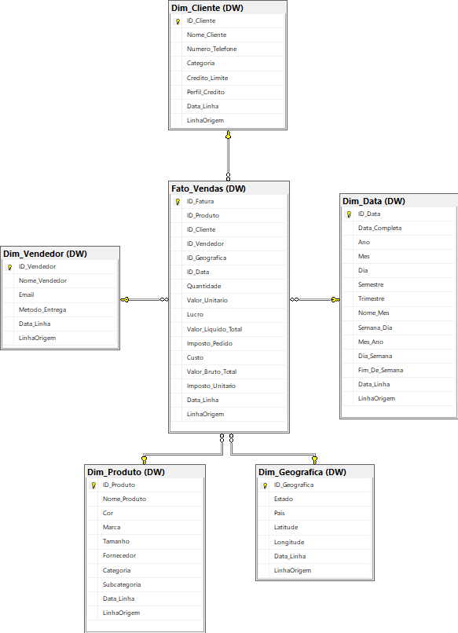
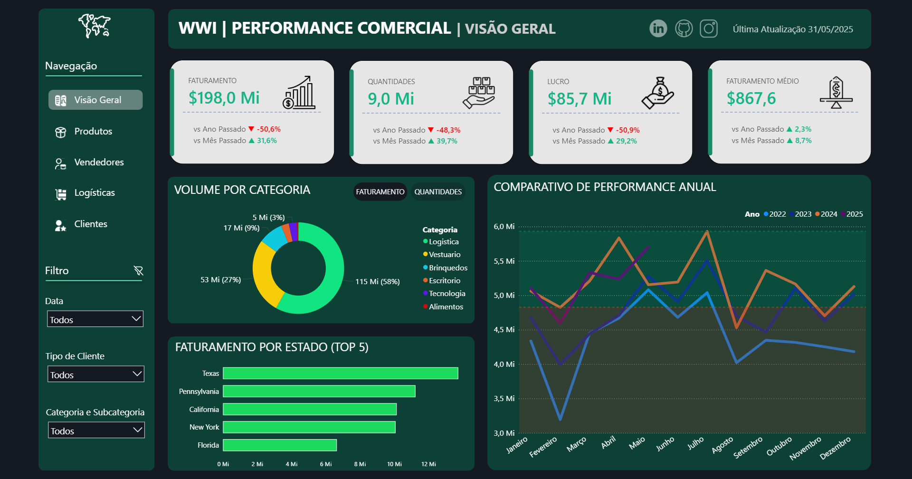

# 🚀 Pipeline de Dados: Engenharia & Analytics - WideWorldImporters

### 🛠️ Infraestrutura


### 🧠 Diferenciais: IA & Integrações


> **Solução End-to-End: SQL Server ➔ Python (IA/ETL) ➔ Streamlit ➔ Power BI**

---

## 🔗 Conecte-se Comigo
Para dúvidas, parcerias ou oportunidades profissionais, sinta-se à vontade para me contatar:

*   **LinkedIn:** [Acesse meu perfil profissional aqui](https://www.linkedin.com/in/vini31/)

---

## 📺 Demonstração em Vídeo
▶️ **[Assista à apresentação técnica do projeto aqui](https://youtu.be/ubhheIY4XdE)**
*(Confira em menos de 4 minutos como o projeto automatiza o ETL com LLM e gera os insights no Power BI)*

---

## 🎯 Objetivo do Projeto
Este projeto foi desenvolvido para extrair, tratar e carregar dados de faturamento do banco **WideWorldImporters**. O foco principal foi transformar dados brutos em inteligência geográfica e categórica, utilizando IA para enriquecimento e Power BI para visualização estratégica de KPIs.

- **Fonte de Dados:** [WideWorldImporters-Full.bak](https://github.com/Microsoft/sql-server-samples/releases/tag/wide-world-importers-v1.0)

---

## 🏗️ Arquitetura e Modelagem
*   **Banco de Dados:** Microsoft SQL Server.
*   **Modelagem:** Implementação de um **Data Warehouse** em estrutura **Star Schema** (Tabelas Fato e Dimensão), otimizando a performance em consultas analíticas complexas.
*   **Interface de Controle:** Dashboard em **Streamlit** para monitoramento e execução manual do pipeline de dados.

### 📁 Estrutura de Armazenamento (`/data`)

Para garantir a organização, rastreabilidade e a reprodutibilidade dos dados, o projeto utiliza o conceito de **Arquitetura Medalhão (Medallion Architecture)** simplificada dentro do diretório de dados:

### Diretórios
```bash
📂 data
├── 📁 bronze       # Dados brutos (sem alterações)
├── 📁 silver       # Dados limpos e tratados via Python
└── 📁 gold         # Tabelas Dimensões e Fatos prontas para o DW
```

### 📐 Modelagem do Data Warehouse (DER)


*O diagrama acima ilustra a estrutura de Tabelas Fato e Dimensões criada para suportar as análises de faturamento e logística.*

### 🗄️ Estrutura do Banco de Dados
Os scripts SQL para criação do Data Warehouse, incluindo tabelas de dimensões, fato, relacionamentos e views, estão disponíveis na pasta `/sql`.

1. **01_views_origem_wwi.sql**: Criação de visualizações no banco original para extração de dados.
2. **02_tabelas_destino_dw.sql**: Definição da estrutura das tabelas de dimensões e fatos no Data Warehouse.
3. **03_relacionamentos_dw.sql**: Configuração de chaves primárias, estrangeiras e integridade referencial do DW.
4. **04_manutencao_reset.sql**: Scripts de limpeza e reset de dados para novos ciclos de carga.

---

## 🛠️ Diferenciais Técnicos (O "Motor" do Projeto)

Apliquei camadas de robustez essenciais para um ambiente de dados profissional:

*   **Inteligência Artificial (LLM):** Integração com a API do Google Gemini para categorização automática de produtos, eliminando erros de classificação manual.
*   **Geolocalização (Geopy):** Conversão de endereços em coordenadas geográficas para análise de calor e logística no mapa.
*   **Tratamento Avançado (Regex):** Uso de Expressões Regulares para limpeza profunda e padronização de strings complexas.
*   **Integridade de Dados:** Lógica de **verificação de duplicidade** integrada para garantir que apenas dados únicos cheguem ao Data Warehouse.
*   **Governança e Logs:** Implementação de uma **Tabela de Logs** que registra cada etapa do ETL, garantindo rastreabilidade total de sucessos e falhas.

---

## 📊 Visualização de Dados (Power BI)



🔗 **[CLIQUE AQUI PARA ACESSAR O DASHBOARD](https://app.powerbi.com/view?r=eyJrIjoiZmVlZDFiZTAtYmFjZi00YTVjLTk3ZDItMDJjYzQ3MDczNDQ0IiwidCI6ImQ0ZmQ2MjE4LTg0MjQtNGFhMy05M2EzLTBlMTI3NDNkYWZjYiJ9)**

*Neste dashboard, você poderá navegar pelas métricas de faturamento, lucro, custos, etc. Em tempo real.*

---

## 🔧 Configuração do Ambiente

### 1. Pré-requisitos
* **SQL Server** com o banco **WideWorldImporters** configurado.
* **Python**.
* **Google Gemini API Key** - Obtenha gratuitamente no [Google AI Studio](https://aistudio.google.com/app/apikey).

### 2. Instalação
Clone o repositório e instale as dependências via `requirements.txt`:

```bash
pip install -r requirements.txt
```

### 3. Configuração de Credenciais
1. Localize o arquivo `.env.example` na raiz do projeto.
2. Renomeie o arquivo para `.env`.
3. Abra o arquivo e insira sua chave no campo indicado:
```env
Gemini-API-Key=Insira_sua_chave_aqui
```

### 4. Execução do Projeto
Para iniciar o pipeline e a interface de monitoramento:
```bash
streamlit run ETLControlTower.py
```


---

### ⚖️ Licença
Este projeto está sob a licença MIT. Veja o arquivo [LICENSE](LICENSE) para mais detalhes.

**Desenvolvido com ☕ e 🐍 por Vinícius Lima**
